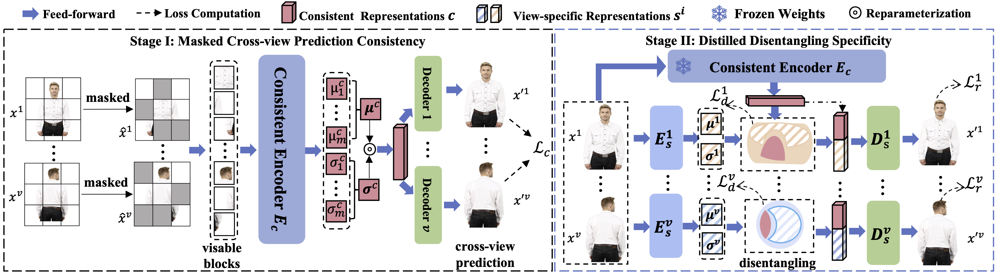

# MRDD
在本仓库代码的基础上进行了《智能计算实践课程》要求的复现与改进工作。
The official repos for "Rethinking Multi-view Representation Learning via Distilled Disentangling" (MRDD)

## Abstract

Multi-view representation learning aims to derive robust representations that are both view-consistent and view-specific from diverse data sources. This paper presents an in-depth analysis of existing approaches in this domain, highlighting a commonly overlooked aspect: the redundancy between view-consistent and view-specific representations. To this end, we propose an innovative framework for multi-view representation learning, which incorporates a technique we term `distilled disentangling'.
Our method introduces the concept of \textit{masked cross-view prediction}, enabling the extraction of compact, high-quality view-consistent representations from various sources, without incurring extra computational overhead. Additionally, we develop a distilled disentangling module that efficiently filters out consistency-related information from multi-view representations, resulting in purer view-specific representations.
This approach significantly reduces redundancy between view-consistent and view-specific representations, enhancing the overall efficiency of the learning process. Our empirical evaluations reveal that higher mask ratios substantially improve the quality of view-consistent representations. Moreover, we find that reducing the dimensionality of view-consistent representations relative to that of view-specific representations further refines the quality of the combined representations.




- Status:  Accepted at CVPR 2024 (Poster).

## Citation

```bib
@inproceedings{ke2023disentangling,
  title={Disentangling multi-view representations beyond inductive bias},
  author={Ke, Guanzhou and Yu, Yang and Chao, Guoqing and Wang, Xiaoli and Xu, Chenyang and He, Shengfeng},
  booktitle={Proceedings of the 31st ACM International Conference on Multimedia},
  pages={2582--2590},
  year={2023}
}

@article{ke2024rethinking,
  title={Rethinking Multi-view Representation Learning via Distilled Disentangling},
  author={Ke, Guanzhou and Wang, Bo and Wang, Xiaoli and He, Shengfeng},
  journal={arXiv preprint arXiv:2403.10897},
  year={2024}
}
```
